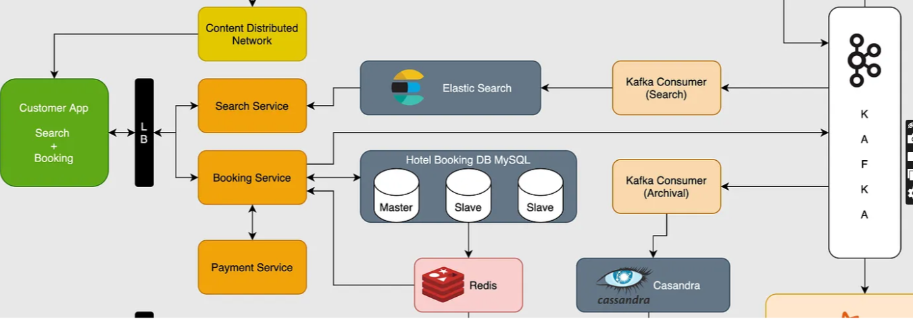

# Requirement Analysis in Software Development.

The **Requirement Analysis Project** focuses on crafting a comprehensive foundation for software development by documenting, analyzing, and structuring requirements. Through a series of well-defined tasks, learners will create a detailed blueprint of the requirement analysis phase for a booking management system. This project simulates a real-world development scenario, emphasizing clarity, precision, and structure in defining requirements to set the stage for successful project execution.

## What is Requirement Analysis?

Requirement Analysis is a critical phase in the software development lifecycle (SDLC) where the project team gathers, analyzes, and defines the requirements of the software product to be developed. This process ensures that all stakeholders have a clear and mutual understanding of what the system should do and how it should perform.

## Why is Requirement Analysis Important?

-  **Clarity and Understanding:** It helps in understanding what the stakeholders expect from the software, reducing ambiguity.
-  **Scope Definition:** Clearly defines the scope of the project, which helps in preventing scope creep.
-  **Basis for Design and Development:** Provides a solid foundation for designing and developing the system.
-  **Cost and Time Estimation:** Facilitates accurate estimation of project cost, resources, and time.
-  **Quality Assurance:** Ensures that the final product meets the specified requirements, leading to higher customer satisfaction.

## Key Activities in Requirement Analysis.

- **Requirement Gathering:**  Collecting and understanding stakeholder needs and expectations for a system or project.
- **Requirement Elicitation:** Drawing out, discovering, or extracting requirements from users and other stakeholders.
- **Requirement Documentation:** Recording all identified requirements clearly, precisely, and unambiguously for future use.
- **Requirement Analysis and Modeling:** Examining, structuring, and representing requirements using models for better understanding.
- **Requirement Validation:** Ensuring documented requirements are correct, complete, consistent, and meet user needs.

## Types of Requirements
### Functional Requirements
- **Definition:** Describe what the system should do.
- **Examples:** User authentication, property search, booking system, user registration.
### Non-functional Requirements
- **Definition:** Describe how the system should perform.
- **Examples:** Performance, security, scalability, usability, reliability.

## Use Case Diagrams
Use case diagrams show how different users (actors) interact with the system to achieve specific goals (use cases).

### Benefits of Use Case Diagrams
- Provide a clear visual representation of system functionalities.
- Help in identifying and organizing system requirements.
- Facilitate communication among stakeholders and development team

## Acceptance Criteria
Acceptance criteria are conditions that a feature must meet to be accepted by the stakeholders.

### Importance of Acceptance Criteria in Requirement Analysis
- Ensure all parties have a clear understanding of feature requirements.
- Provide a basis for testing and validation.
- Help in maintaining quality and meeting user expectation

### Acceptance criteria in practice
Here are examples of acceptance criteria for a booking system's **checkout** feature, using the Given-When-Then format, which defines preconditions, actions, and expected results: 

1.  **Payment Initiation:**
-     Given: a user has a confirmed booking and is logged in,
-     When: they click on the "Proceed to Checkout" button,
-     Then: they should be directed to the checkout page with their booking details pre-filled.

2.  **Payment Method Selection:**
-     Given: the user is on the checkout page,
-     When: they select a payment method (e.g., credit card, bank transfer),
-     Then: the appropriate payment form fields for that method should be displayed.

3.  **Successful Payment Processing:**
-     Given: the user has entered valid payment details,
-     When: they click the "Confirm Payment" or "Pay Now" button,
-     Then: the system should process the payment, and the booking status should be updated to "Paid".

4.  **Confirmation and Notification:**
-     Given: the payment is successfully processed,
-     When: the checkout process is complete,
-     Then: the user should see a confirmation screen, and an email with the booking confirmation and payment receipt should be sent to their registered email address.

5.  **Error Handling (Incorrect Details):**
-     Given: the user has entered invalid payment details,
-     When: they click the "Confirm Payment" button,
-     Then: an error message should be displayed, indicating the specific issue, and the payment should not be processed. 